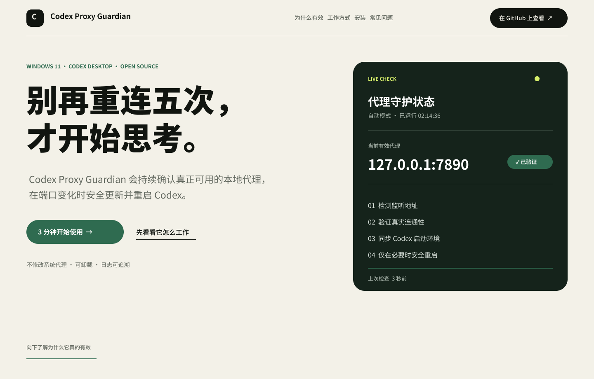
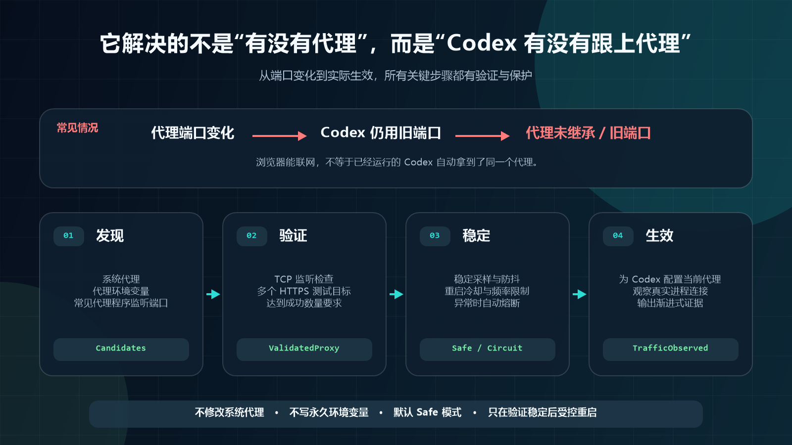

# Codex Proxy Guardian

> 让 Codex 始终使用当前有效代理，减少因代理未继承或端点变化造成的 `Reconnecting 1/5 → 5/5`。

[简体中文](README.md) · [English](docs/README.en.md)

[](https://github.com/CH-ZHOU-0512/codex-proxy-guardian/actions/workflows/ci.yml) [](https://github.com/CH-ZHOU-0512/codex-proxy-guardian/releases/latest) [](LICENSE)

**[下载最新正式版](https://github.com/CH-ZHOU-0512/codex-proxy-guardian/releases/latest)** · [在线项目页](https://ch-zhou-0512.github.io/codex-proxy-guardian/) · [使用文档](https://github.com/CH-ZHOU-0512/codex-proxy-guardian/wiki) · [问题讨论](https://github.com/CH-ZHOU-0512/codex-proxy-guardian/discussions)

Codex Proxy Guardian 是一个非官方、跨平台的 **Codex 代理守护工具**。它会持续发现并真实验证 HTTP/HTTPS、SOCKS5 和 PAC/WPAD 代理；代理端口变化后，再安全地让 Codex 跟上当前有效端点。

> [!NOTE]
> 它不是代理软件，不提供订阅或节点。你的电脑上需要已有 Clash、Mihomo、v2rayN、sing-box 等可用代理。

> [!IMPORTANT]
> **Codex 显示“正在重新连接”，不等于 Guardian 重启了 Codex。** Guardian 负责代理发现、验证和 Codex 启动参数；它不能修复代理服务商节点自身的丢包、TLS EOF、WebSocket reset、Windows `10054` 或请求超时。请对照同一时间的 Guardian 日志：存在 `codex_restart` / `proxy_changed` 才说明 Guardian 生命周期操作可能相关；两者都没有时，通常是上游流式连接断开。详见[重连归因](#如何判断是谁造成的重连)。

> [!TIP]
> **v1.5.2 修复了“Codex 更新后触发过检查，但 Guardian 实际没有更新”的链路缺陷。** 更新器会复用已验证的 HTTP/HTTPS/SOCKS 代理，核对任务最终结果，并在失败后针对同一 Codex 版本继续重试；“已经是最新版”只会在真实访问 GitHub 成功后显示。

## 30 秒看懂

| 你遇到的问题 | Guardian 会做什么 | 你需要做什么 |
|---|---|---|
| Codex 没有继承当前代理，或仍使用旧端口 | 验证并跟随 Codex 实际需要的代理端点 | 安装一次 |
| 切换节点后端口变了 | 重新发现、防抖、验证，再更新 Codex | Windows/macOS 继续点原图标 |
| Codex 更新后又开始重连 | 区分“系统代理仅承载 HTTP”和“流式代理已显式继承” | 任务完成后批准一次受管修复 |
| 自动更新开启却没有跟上 | 复用已验证代理、读取真实结果、失败后继续重试 | v1.5.1 若长期联网失败，手动原位升级一次 |
| 守护脚本让 Codex 反复重启 | 使用冷却、频率限制和熔断 | 保持默认“自动”模式 |
| Linux CLI 没有继承新代理 | 将已验证代理注入新进程 | 用 `codex-guard` 启动 Codex |

[](https://ch-zhou-0512.github.io/codex-proxy-guardian/)

## 如何判断是谁造成的重连

| 同一时间的证据 | 更可能的原因 | 怎么处理 |
|---|---|---|
| Guardian 日志出现 `codex_restart` 或 `proxy_changed` | Guardian 执行了生命周期操作 | 附上脱敏 Doctor 与时间提交 Issue |
| 没有上述事件，Codex 出现 TLS EOF、WebSocket reset、`10054` 或超时 | 当前代理服务商节点或其上游链路断流 | 在代理软件中换稳定节点 |
| `ProxyCriticalTargetsPassed=false` | `chatgpt.com` 关键入口没有通过验证 | 查看 `ProxyCriticalFailures`，再检查节点 |
| `GuardianState=ObservingAfterCodexUpdate` | 新版 Codex 正在完成连续验证 | 保持 Codex 打开，等待观察完成 |
| `GuardianState=UpstreamSuspected` | 本地端口可达，但关键外部验证失败 | 保持 Codex 打开，在代理软件中换节点 |
| `StreamingProxyGuaranteed=false` | HTTP 可能已走系统代理，但 WebSocket/流式进程没有受管启动证据 | 完成任务后批准提示，或打开 **Codex (Managed Proxy)** |
| `GuardianState=CodexCompatibilityReviewRequired` | 新版的启动适配未能自动确认，已进入安全保持 | 保持 Codex 打开；Guardian 会自动检查适配更新 |

Guardian 会尝试其他已经发现且通过验证的地址或协议，但不会擅自切换 Clash/Mihomo/v2rayN 等软件里的订阅节点，也不会修改系统网络配置。这个边界既避免误操作，也意味着服务商节点不稳定时仍需要用户在代理软件中换节点。

## 快速开始

### Windows 11（推荐）

1. 打开[最新正式版](https://github.com/CH-ZHOU-0512/codex-proxy-guardian/releases/latest)。
2. 下载 `CodexProxyGuardian-Setup-版本号.exe`。
3. 双击安装，以后照常点原来的 Codex 图标。

Guardian 会安装到当前用户、立即启动并随登录静默运行，不需要管理员权限。安装时窗口会显示当前阶段和 0–100% 进度，不再只是一直转圈。

> [!WARNING]
> 项目暂无商业代码签名证书，SmartScreen 可能显示“无法识别”。请只从本仓库 Release 下载；不确定时使用下方 ZIP 方式，不要关闭 Windows 安全功能。

<details>
<summary><strong>Windows ZIP 手动安装</strong></summary>

下载 `CodexProxyGuardian-版本号.zip` 和对应 `.sha256`，解压后在普通权限 PowerShell 中运行：

```powershell
Unblock-File .\Install.ps1
.\Install.ps1
```

如果执行策略不允许：

```powershell
powershell.exe -NoProfile -ExecutionPolicy Bypass -File .\Install.ps1
```

</details>

<details>
<summary><strong>macOS（Intel / Apple Silicon）</strong></summary>

从 Release 下载与 CPU 匹配的 `darwin-amd64` 或 `darwin-arm64` 包，解压后运行：

```sh
./install.sh
codex-proxy-guardian doctor
```

安装器会注册当前用户 LaunchAgent。以后照常打开 ChatGPT/Codex。

</details>

<details>
<summary><strong>Linux（x64 / ARM64）</strong></summary>

从 Release 下载 `linux-amd64` 或 `linux-arm64` 包，解压后运行：

```sh
./install.sh
codex-proxy-guardian doctor
codex-guard
```

安装器优先使用 systemd user，不可用时回退到 XDG Autostart。Linux 上请用 `codex-guard` 启动官方 Codex CLI；Guardian 不会强杀或重启交互式终端会话。

</details>

## 安装后怎么用

| 平台 | 日常用法 | 是否要每次手动启动 Guardian |
|---|---|---|
| Windows 11 | 推荐点 **Codex (Managed Proxy)**；点原图标时 Guardian 会在需要修复时询问 | 不需要 |
| macOS | 继续正常打开 ChatGPT/Codex | 不需要 |
| Linux | 用 `codex-guard` 代替 `codex` | 不需要，但 CLI 要由 `codex-guard` 启动 |

Windows 会安装 **Codex (Managed Proxy)** 快捷方式。它是当前最可靠的日常入口：启动时同时注入 `HTTP_PROXY`、`HTTPS_PROXY`、`ALL_PROXY`、`WS_PROXY`、`WSS_PROXY` 和 Chromium 代理参数。继续点原来的 Codex 图标也可以，但新版 Codex 只通过系统代理产生 HTTP 流量时，Guardian 会先弹窗询问；只有明确同意后才切换到受管启动。

## 支持范围

### 平台

| 平台 | 支持的 Codex | 后台自启 | 处理方式 |
|---|---|---|---|
| Windows 11 x64 / ARM64 | Store / MSIX 桌面端 | 计划任务 / HKCU Run | 必要时受控修复桌面端 |
| macOS Intel / Apple Silicon | ChatGPT/Codex 桌面应用 | LaunchAgent | 必要时受控修复桌面应用 |
| Linux x64 / ARM64 | 官方 Codex CLI | systemd user / XDG Autostart | 通过 `codex-guard` 注入代理 |

### 代理类型

| 代理环境 | 支持 | 说明 |
|---|---:|---|
| HTTP / HTTPS / 混合端口 | ✓ | 发现后仍要通过真实 HTTPS 请求 |
| SOCKS5 / SOCKS5H | ✓ | 支持代理端 DNS 解析 |
| 系统 PAC / WPAD | ✓ | 按实际 OpenAI/ChatGPT 目标解析并验证 |
| 手动指定 PAC | ✓ | 使用 `ExplicitPAC` |
| SOCKS4 | — | 安全拒绝 |
| 带账号密码的代理 URL | — | 避免凭据进入配置和日志 |
| 只有 TUN，没有可见代理端点 | — | 没有可注入 Codex 进程的端点 |

PAC 可能为不同目标返回不同路线。只有同一候选达到多目标成功门槛时 Guardian 才会接管；路线互不兼容时保持原状，不猜测。完整细节见[兼容性矩阵](docs/SUPPORT.md)。

## 为什么它不只是“改个端口”



1. **发现**：读取系统代理、PAC/WPAD、显式配置、环境变量和常见代理程序监听。
2. **真实验证**：不只看端口是否打开，还要经该代理访问多个 HTTPS 目标。
3. **稳定判断**：经过防抖后才确认端点变化，避免被短暂波动误导。
4. **受控生效**：使用进程级环境变量和 Chromium 参数，并受冷却、重启限制和熔断保护。

## 自动还是严格？

| 模式 | 行为 | 适合谁 |
|---|---|---|
| **自动（Safe）** | 先等待并观察真实代理流量；Codex 更新后还要通过连续关键入口验证，确认后才保持不动 | 绝大多数用户，默认推荐 |
| **严格（Enforce）** | 发现 Codex 缺少当前代理参数时，经防抖并由用户确认后受控修复 | 要求启动参数始终严格一致的机器 |

**不确定就保持默认“自动”。** 模式可在 Windows 开始菜单的 **Codex Proxy Guardian Settings** 中切换，不需要手改 JSON，也不会因切换模式而重启 Codex。

## 安全边界

- **不修改**系统代理、WinHTTP、DNS、路由、防火墙或永久环境变量。
- 代理候选必须通过真实网络验证；不按常见端口盲猜协议。
- 同一主机与端口的 HTTP/SOCKS5 波动不会关闭 Codex；真正需要关闭现有 Codex 时，Windows 默认先询问，只有明确同意才执行。
- 默认只信任回环地址和操作系统已配置的远程代理；任意显式远程代理需主动授权。
- PAC 下载、DNS、执行时间、大小和缓存均有上限；WPAD 只在系统已启用时使用。
- 诊断报告默认脱敏，卸载时只删除已核对为本项目所有的资源。

> [!IMPORTANT]
> 本项目与 OpenAI 没有隶属、认可或支持关系。它是基于实际行为的社区兼容方案，不是 Codex 公开且承诺长期稳定的代理 API。

## 如何确认它真的生效

Windows：

```powershell
.\Status.ps1
.\Doctor.ps1 -Online
```

macOS/Linux：

```sh
codex-proxy-guardian status
codex-proxy-guardian doctor
```

| 证据 | 代表什么 |
|---|---|
| `ValidatedProxy` | 代理端口可连接、真实 HTTPS 请求达到成功门槛，且 `chatgpt.com` 关键目标通过 |
| `LaunchConfigured` | Codex 根进程带有同一个规范化代理参数 |
| `SystemProxyHttpTrafficOnly` | 观察到普通 Codex 通过系统代理通信，但这不足以证明 WebSocket 已继承显式代理 |
| `ManagedTrafficObserved` | 受管启动参数已匹配，并观察到 Codex 进程树连接该代理端点 |
| `TrafficObserved` | macOS/Linux 已观察到 Codex 进程树连接代理端点；Windows v1.5.1 使用上面两种更精确的状态 |
| `PostUpdateObservation` | 新版 Codex 已启动，正在累计新鲜关键入口验证，期间不接受一次流量作为稳定结论 |
| `EndpointReachableOnly` | 本地监听存在，但关键外部验证失败；Guardian 保留 Codex 并提示检查上游节点 |

`ManagedTrafficObserved` 是不抓包时能提供的最强本地证据，但仍不代表特定出口 IP、地区或代理规则一定符合预期。短 HTTPS 探测和本地 TCP 流量也不能从外部证明登录态下的长时流绝对稳定，所以状态会诚实显示 `StreamStability=IndirectEvidenceOnly`。完整标准见[兼容性与有效性测试](docs/COMPATIBILITY-TESTING.md)。

Codex 每次更新时，Guardian 会重新解析 MSIX 清单与真实入口进程、生成能力指纹、执行上述观察，并立即启动仓库 Release 的受信更新任务。若现有通用适配仍有效，会自动继续；若 Codex 改掉了未公开的启动机制，Guardian 会失败安全地保持当前进程、停止自动重启，并等待本项目自动更新到新适配。任何社区工具都无法在上游彻底改变未知接口时“凭空发明”新代码，但这一机制让普通用户不必手动重装、改配置或反复试错。

从 v1.5.2 起，Windows 不再把“计划任务成功启动”等同于“更新成功”。更新检查会优先复用 Guardian 已验证的代理，记录 `Running`、`Current`、`Installed` 或 `FailedRetryScheduled` 等真实结果；同一 Codex 版本失败后仍会重试，每日检查继续兜底。

### 面向以后每个 Codex 版本的兼容契约

这不是按某几个版本号写死的补丁。每次检测到 Codex 包版本变化，Guardian 都会使旧证据失效，重新解析入口并要求新鲜关键目标验证；Windows 还必须同时取得“受管启动参数匹配 + 新进程真实代理流量”，才会把该组合记为兼容。失败时不反复重启，而是进入安全保持并立即检查签名/哈希校验的 Guardian Release，日常自动更新继续兜底。

能自动化的是**发现变化、通用适配、重新验证、精确降级和安装已经发布的适配**。如果未来 Codex 删除现有启动机制或引入全新协议，任何本地工具都不能在新代码尚未发布时自动发明实现；Guardian 的承诺是先保护任务并报告准确证据，适配发布后再通过受信自动更新接管。

## 常见问题

### Codex 还在反复重启

1. 先升级到 v1.5.1 或更高版本；旧版会把普通启动产生的系统代理 HTTP 流量误当成流式代理已完整继承。
2. 保持或切回“自动（Safe）”。
3. 运行 `Status.ps1` 查看 `GuardianState` 和最近重启原因。
4. 运行 `Doctor.ps1 -Online` 生成脱敏诊断。
5. 参阅[故障排查](docs/TROUBLESHOOTING.md)或提交 [Bug report](https://github.com/CH-ZHOU-0512/codex-proxy-guardian/issues/new?template=bug_report.yml)。

### Windows 自动更新没有跟上

v1.0.0–v1.3.0 在 Windows PowerShell 5.1 下可能误报 `update_not_available`。请从[最新正式版](https://github.com/CH-ZHOU-0512/codex-proxy-guardian/releases/latest)手动原位安装一次；已有配置会保留，之后自动更新即可恢复。

v1.4.4 起，Settings 不会把“更新器正忙、本次没有执行检查”翻译成“最新版”。检查结果会列出本机版本、远端版本、通道、检查时间和 GitHub Releases 来源；界面切换通道后可以直接检查，不必先应用设置。

v1.5.1 的更新器还存在一个独立问题：它没有复用 Guardian 已验证的代理，而且任务启动后即使联网失败，也不会针对同一 Codex 版本再次即时检查。v1.5.2 已改为核对真实终态并自动重试。由于缺陷就在旧更新器自身，始终无法访问 GitHub 的 v1.5.1 需要从[最新正式版](https://github.com/CH-ZHOU-0512/codex-proxy-guardian/releases/latest)手动原位安装一次；已有配置会保留。

### Guardian 没有重启，为什么仍出现“正在重新连接”？

先运行 `Status.ps1`。如果 `StreamingProxyGuaranteed=false` 或 `EffectivenessEvidence=SystemProxyHttpTrafficOnly`，说明普通启动的 HTTP 已经走代理，但新版 Codex 的 WebSocket/流式子进程没有取得显式代理环境。完成当前任务后批准 Guardian 的修复提示，或关闭 Codex 后从 **Codex (Managed Proxy)** 打开；受管启动会同时注入 HTTP/HTTPS/ALL/WS/WSS 代理。

如果 `StreamingProxyGuaranteed=true`，而同一时间 Guardian 日志没有 `codex_restart` / `proxy_changed`，重连通常来自代理上游节点重置或超时，不等于 Guardian 重启了应用。本地端口可达但关键入口失败时会显示 `UpstreamSuspected`，并明确保持当前 Codex 不动。

Guardian 无法在不改变用户网络选择的前提下修复代理服务商节点自身的丢包。若 `Status.ps1` 显示关键目标失败，或代理软件日志出现 `i/o timeout`、TLS EOF、WebSocket reset，请在代理软件中换一个稳定节点；Guardian 不会擅自替你切节点或修改系统代理。

### 会不会改坏系统网络？

不会。Guardian 只读取系统代理候选，并管理 Codex 自身的启动环境；它不改写系统代理、DNS、路由或防火墙。

更多解答见 [Wiki FAQ](https://github.com/CH-ZHOU-0512/codex-proxy-guardian/wiki/FAQ)。

<details>
<summary><strong>高级：手动指定代理或 PAC</strong></summary>

配置文件位置：

- Windows：`%LOCALAPPDATA%\CodexProxyGuardian\config.json`
- macOS：`~/Library/Application Support/CodexProxyGuardian/config.json`
- Linux：`${XDG_CONFIG_HOME:-~/.config}/codex-proxy-guardian/config.json`

```json
{
  "ExplicitProxy": "socks5h://127.0.0.1:1080",
  "ExplicitPAC": "",
  "AutomaticUpdates": true,
  "UpdateChannel": "Stable",
  "RequireManagedLaunchForStreaming": true,
  "NotifyBeforeCodexRestart": true,
  "RestartPromptTimeoutSeconds": 45,
  "RestartPromptSnoozeMinutes": 10,
  "AllowNonLoopbackProxy": false,
  "AllowSystemNonLoopbackProxy": true
}
```

`ExplicitProxy` 可使用 `http://`、`https://`、`socks5://` 或 `socks5h://`。`ExplicitPAC` 可指定 HTTP/HTTPS PAC URL；macOS/Linux 还接受本地 `file://` PAC。完整字段见 [config.schema.json](config/config.schema.json)。

</details>

<details>
<summary><strong>高级：自动更新、卸载与本地构建</strong></summary>

更新器只信任本仓库 Release，并核对标签、版本、资产名称、包内 `VERSION` 和 SHA-256。Windows 会优先使用 Guardian 已验证的代理；HTTP/HTTPS 由 PowerShell 使用，SOCKS5/SOCKS5H 由 Windows 11 自带的 `curl.exe` 使用，且不会改写系统网络配置。

```powershell
.\Control.ps1 -Action CheckUpdate
.\Control.ps1 -Action Update
.\Uninstall.ps1 -Confirm:$false
```

macOS/Linux：

```sh
codex-proxy-guardian update
codex-proxy-guardian update --install
./uninstall.sh
```

本地测试与打包：

```powershell
.\tests\Run-Tests.ps1
.\tools\Package-Release.ps1
```

</details>

## 文档导航

| 想了解什么 | 文档 |
|---|---|
| 从安装到日常使用 | [Wiki：安装与日常使用](https://github.com/CH-ZHOU-0512/codex-proxy-guardian/wiki/Getting-Started) |
| 平台、协议和已知边界 | [兼容性矩阵](docs/SUPPORT.md) |
| 为什么它真的有效 | [兼容性与有效性测试](docs/COMPATIBILITY-TESTING.md) |
| 反复重启、找不到代理、更新失败 | [故障排查](docs/TROUBLESHOOTING.md) |
| 实现原理和信任边界 | [架构说明](docs/ARCHITECTURE.md) |
| 一般疑问 | [Wiki FAQ](https://github.com/CH-ZHOU-0512/codex-proxy-guardian/wiki/FAQ) |

## 参与项目

- [报告问题](https://github.com/CH-ZHOU-0512/codex-proxy-guardian/issues/new?template=bug_report.yml)
- [建议功能](https://github.com/CH-ZHOU-0512/codex-proxy-guardian/issues/new?template=feature_request.yml)
- [参与讨论](https://github.com/CH-ZHOU-0512/codex-proxy-guardian/discussions)
- [贡献代码](CONTRIBUTING.md)

提交反馈前，请不要上传代理账号、节点、IP、令牌或未经人工检查的完整日志。

## 许可证与声明

本项目采用 [MIT 许可证](LICENSE)。“Codex”和“OpenAI”可能是其各自所有者的商标，详见[非官方与商标声明](DISCLAIMER.md)。
