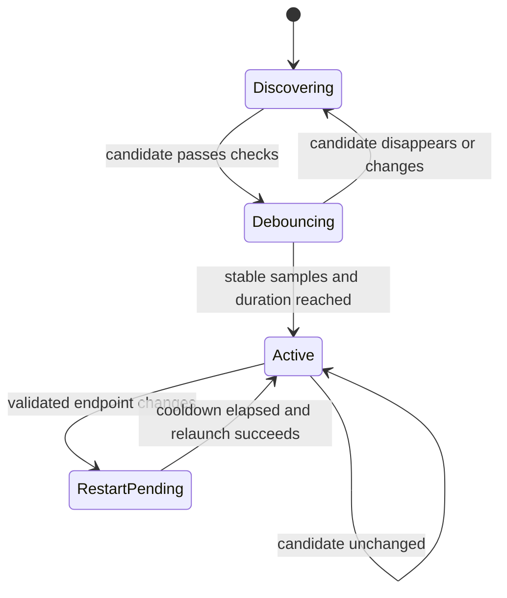

# Architecture

## Data flow

The guardian reads but never writes Windows proxy configuration. Candidate priority is explicit configuration, then Windows manual proxy, then recognized local listeners. A candidate becomes active only after validation and debounce.

## Codex resolution

`Get-AppxPackage` locates a configured package name for the current user. `Get-AppxPackageManifest` supplies the application ID and relative executable. This avoids version-, username-, architecture-, and WindowsApps-path assumptions.

Root processes are matched by exact resolved executable path and absence of an Electron child-process `--type=` argument. A managed root is recognized by the normalized `--proxy-server` command-line value, which remains meaningful across launcher PID handoff.

## Restart state machine

In Safe mode, an ordinary Codex root missing the launch argument is observed but not replaced. In Enforce mode it is debounced and relaunched. Either mode can restart a running Codex instance after a validated endpoint change.

## Persistence and isolation

- `state.json` stores the last validated endpoint and last restart time.
- `status.json` is an atomic operational snapshot.
- JSONL logs rotate by date, size, retention, and file count.
- A mutex derived from the normalized install path gives each installation a distinct single-instance boundary.
- Proxy variables are written only to the guardian process immediately before it launches Codex. They are inherited by that process tree and never persisted to User or Machine scope.

## Security boundaries

- URLs containing user information are rejected.
- Remote/non-loopback proxies require explicit opt-in.
- The updater refuses a non-empty, unmarked installation directory.
- The uninstaller requires a product marker whose canonical path matches the requested root.
- Scheduled tasks, Run values, and shortcuts are removed only when they still point to that root.
- The HTTPS validation endpoint is configurable and receives only an unauthenticated HEAD request.
