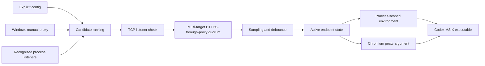
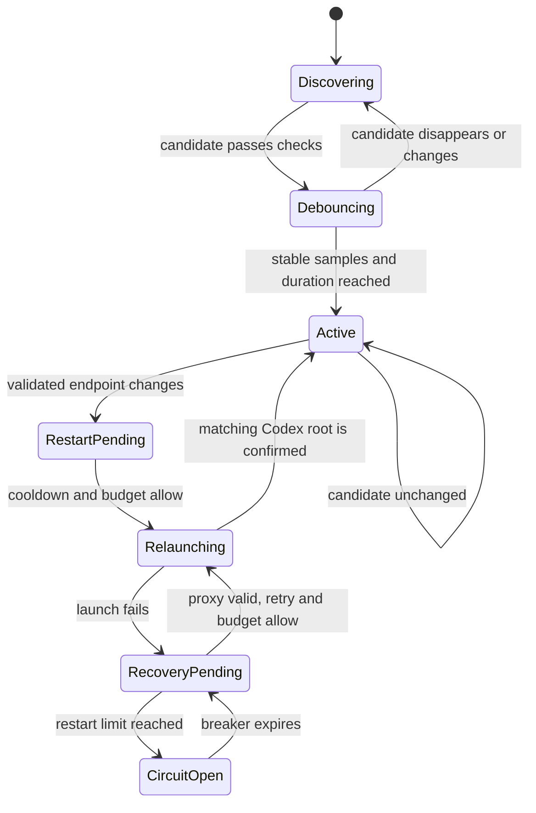

# Architecture

## Data flow

The guardian reads but never writes Windows proxy configuration. Candidate priority is an explicit override, explicit configuration, Windows manual proxy, inherited HTTP-compatible proxy variables, then recognized local listeners. A candidate becomes active only after validation and debounce. Ordering is deterministic, and the current endpoint wins ties within its priority tier.

## Codex resolution

`Get-AppxPackage` locates a configured package name for the current user. `Get-AppxPackageManifest` supplies the application ID and relative executable. This avoids version-, username-, architecture-, and WindowsApps-path assumptions.

Root processes are matched by exact resolved executable path and absence of an Electron child-process `--type=` argument. A managed root is recognized by the normalized `--proxy-server` command-line value, which remains meaningful across launcher PID handoff.

## Restart state machine

In Safe mode, an ordinary Codex root missing the launch argument enters an evidence grace period. If that exact process tree is observed using the validated proxy, it is left untouched; otherwise one managed repair is attempted after the grace period. In Enforce mode the missing argument is sufficient to trigger a debounced repair. Either mode can restart a running Codex instance after a validated endpoint change, and every repair uses the same cooldown, restart budget, and circuit breaker.

A recovery flag is written before the old Codex process is stopped and cleared only after a matching new root is observed. A failed launch is retried only while the proxy is still valid. A sliding restart window opens a persistent circuit breaker after the configured limit; while open, the guardian performs no further lifecycle action. This converts a bad detection or launch environment into a diagnosable degraded state instead of an endless restart loop or an unreported closed application.

## Effectiveness evidence

1. **ValidatedProxy**: the chosen endpoint has a listener and reaches the configured HTTPS quorum through an explicit .NET `WebProxy` transport.
2. **LaunchConfigured**: a current Codex root command line contains the exact normalized `--proxy-server` token.
3. **TrafficObserved**: an established TCP connection from the Codex process tree to the chosen endpoint was observed within the configured evidence window.

Connection evidence reads only Windows TCP metadata: process ID, remote address, and remote port. It does not inspect packets, URLs, request bodies, authentication, or response content. The evidence proves local use of the endpoint, not its exit geography or policy.

The [official Codex network-isolation documentation](https://learn.chatgpt.com/docs/agent-approvals-security#network-isolation) describes upstream proxy handling for sandboxed command networking when that networking feature is enabled. Desktop control-plane connectivity and the Chromium launch flag used here remain best-effort observed compatibility behavior, so the project reports evidence rather than presenting the flag as a guaranteed Codex API.

## Persistence and isolation

- `state.json` stores the last validated endpoint and last restart time.
- Restart history, circuit-breaker expiry, pending relaunch recovery, and the last observed Codex-to-proxy connection time are persisted across guardian restarts.
- `status.json` is an atomic operational snapshot.
- JSONL logs rotate by date, size, retention, and file count.
- A mutex derived from the normalized install path gives each installation a distinct single-instance boundary.
- Proxy variables are written only to the guardian process immediately before it launches Codex. They are inherited by that process tree and never persisted to User or Machine scope.

## Security boundaries

- URLs containing user information are rejected.
- Remote/non-loopback proxies require explicit opt-in.
- The updater refuses a non-empty, unmarked installation directory.
- The uninstaller requires a product marker whose canonical path matches the requested root.
- Scheduled tasks, Run values, and shortcuts are removed only when they still point to that root.
- The HTTPS validation endpoint is configurable and receives only an unauthenticated HEAD request.
