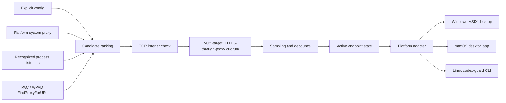
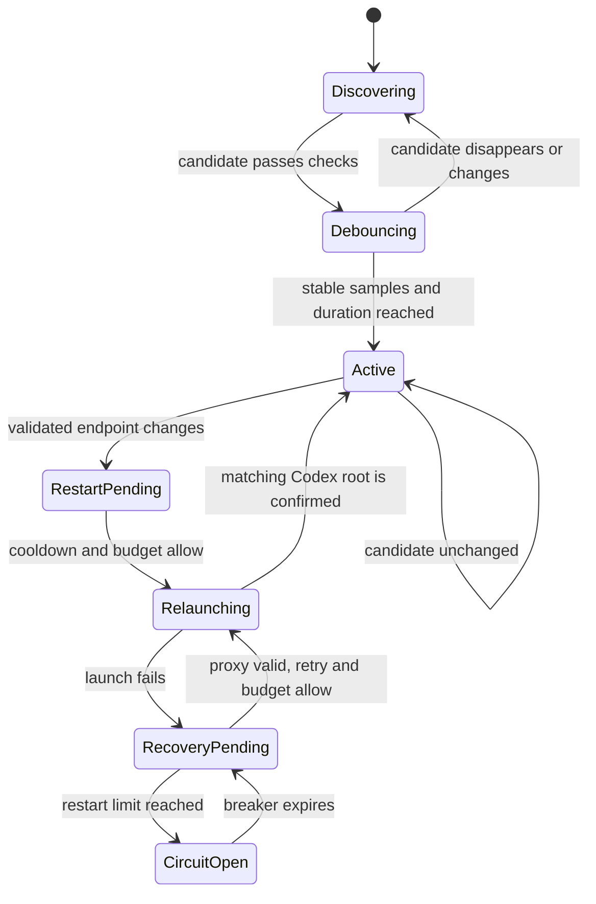

# Architecture

## Data flow

The guardian reads but never writes platform proxy configuration. Candidate priority is explicit configuration, PAC/WPAD routes, the current platform proxy, inherited proxy variables, recognized local listeners, then common loopback ports. HTTP, HTTPS, and SOCKS5 candidates become active only after TCP and explicit proxied-request validation plus debounce. Ordering is deterministic, and the current endpoint wins ties within its priority tier.

Windows delegates PAC/WPAD policy evaluation to the current-user WinHTTP auto-proxy resolver. macOS/Linux fetch and execute `FindProxyForURL` in a pure-Go JavaScript runtime bounded by source size, download time, DNS time, execution time, and cache age. PAC fallback directives are parsed in order; SOCKS4 is ignored. A resolved endpoint must still satisfy the multi-target quorum. If destination-specific PAC routes do not share a usable endpoint, the state machine remains in `WaitingForProxy` rather than flattening them into a false global route.

The Windows implementation remains PowerShell-based. macOS/Linux share a small statically linked Go core and platform adapters:

- macOS reads `scutil --proxy`, discovers listeners with `lsof`, resolves configured app bundle executables, observes an exact root process, and launches with process-scoped proxy variables plus the Chromium proxy argument.
- Linux reads GNOME `gsettings` when available and discovers listeners with `ss`. The daemon maintains validated state; `codex-guard` uses `exec` to replace itself with the official Codex CLI while preserving the TTY and arguments.
- Linux deliberately has no restart state machine for Codex itself. An interactive terminal session cannot be safely reconstructed by a background service, and OpenAI currently ships no official Linux Codex desktop app.

## Codex resolution

`Get-AppxPackage` locates a configured package name for the current user. `Get-AppxPackageManifest` supplies the application ID and relative executable. This avoids version-, username-, architecture-, and WindowsApps-path assumptions.

Root processes are matched by exact resolved executable path and absence of an Electron child-process `--type=` argument. A managed root is recognized by the normalized `--proxy-server` command-line value, which remains meaningful across launcher PID handoff.

On macOS the same exact-path/root-process rule is applied to configured ChatGPT/Codex application bundle executables; Electron child processes are excluded. A graceful AppleScript quit is attempted before a signal is sent, and the signal is allowed only for the same verified root PID. Linux never enumerates and kills Codex CLI processes.

## Restart state machine

In Safe mode, an ordinary Codex root missing the launch argument enters an evidence grace period. If that exact process tree is observed using the validated proxy, it is left untouched; otherwise one managed repair is attempted after the grace period. In Enforce mode the missing argument is sufficient to trigger a debounced repair. Either mode can restart a running Codex instance after a validated endpoint change, and every repair uses the same cooldown, restart budget, and circuit breaker.

On Windows, the resolved Store/MSIX package version is persisted separately from the active proxy. When that version changes, Guardian does not disturb an old process that is still running. Once a root from the new executable path appears, it starts a post-update observation that requires three fresh critical-target validations over at least 60 seconds by default. Cached validations do not increment the sample count. Until the observation completes, Safe-mode local traffic evidence cannot exempt a missing launch argument.

The same version transition immediately starts the installation-owned update scheduled task when automatic updates are enabled. Before starting it, Guardian verifies the install marker, canonical install root, task name, PowerShell action, and exact `Update.ps1` path. This reuses the existing fixed-repository, semantic-version, SHA-256, staged-version, and rollback trust chain instead of introducing remote executable configuration. The daily task remains the fallback when an adapter release is not yet available.

A capability fingerprint covers package identity, version, application ID, root executable name, manifest resolution method, and launch-strategy selection. If a user-approved managed launch returns a Codex root but neither the expected proxy argument nor current-root proxy traffic can be confirmed within the configured timeout, `CodexCompatibilityReviewRequired` is persisted for that Codex/Guardian pair. Recovery intent is cleared and all automatic lifecycle paths are held. A Codex version change or verified Guardian upgrade clears the old pair-specific hold and starts a new audit.

Listener reachability and upstream validation are separate states. A reachable listener with a failed critical external validation becomes `UpstreamSuspected`; the current Codex process is preserved, candidate failover is held for that active physical endpoint, and no lifecycle action is requested for the degradation. A later fresh critical-target success clears the condition. Guardian does not select subscription nodes inside a proxy provider application.

A recovery flag is written before the old Codex process is stopped and cleared only after a matching new root is observed. A failed launch is retried only while the proxy is still valid. A sliding restart window opens a persistent circuit breaker after the configured limit; while open, the guardian performs no further lifecycle action. This converts a bad detection or launch environment into a diagnosable degraded state instead of an endless restart loop or an unreported closed application.

## Mode and update control plane

`Settings.ps1` is a current-user WinForms front end. It delegates changes to `Control.ps1`, which maps the user-facing Automatic/Strict profiles to the internal Safe/Enforce fields, writes `config.json` atomically, and restarts only the guardian when the mode changes.

`Update.ps1` runs independently from the guardian under a daily current-user scheduled task. It selects a newer release from the fixed GitHub repository and configured channel, requires exact tag/archive/staged-version agreement, verifies the attached SHA-256, and only then invokes the staged installer. The existing installer owns migration, task repair, current-Codex adoption, and rollback-by-retention behavior; an update failure leaves the installed tree untouched until verification has completed.

The macOS/Linux daemon performs the same fixed-repository and channel selection once per day. It accepts only the current OS/architecture asset, verifies its attached SHA-256, safely extracts only regular files/directories within bounded size and count, checks the staged `VERSION`, atomically replaces the path recorded by the install marker, and executes the new binary in place. The previous binary is retained as `.previous`.

## Effectiveness evidence

1. **ValidatedProxy**: the chosen endpoint has a listener and reaches the configured HTTPS quorum through an explicit HTTP/HTTPS/SOCKS5 transport. Windows uses .NET for HTTP(S) and inbox `curl.exe` for SOCKS5; the Go core uses an explicit standard-library transport.
2. **LaunchConfigured**: a current Codex root command line contains the exact normalized `--proxy-server` token.
3. **SystemProxyHttpTrafficOnly**: an unmanaged Codex process reached the endpoint through Windows system-proxy behavior. This proves useful HTTP traffic, but not that the Rust WebSocket/streaming child inherited explicit proxy variables.
4. **ManagedTrafficObserved**: the Codex root carries the managed proxy argument and the process tree connected to the chosen endpoint. Guardian's launch path also injects HTTP/HTTPS/ALL/WS/WSS variables into that process tree.
5. **TrafficObserved**: the macOS/Linux daemon observed the Codex process tree connecting to the chosen endpoint. Windows v1.5.1 uses the two more specific traffic states above.
6. **PostUpdateObservation**: a new Codex package root is running, but the required sequence of fresh critical-target validations has not completed.
7. **EndpointReachableOnly**: the local listener is reachable while a critical external validation is failing; this is a diagnostic degradation, never a reason to restart Codex.

Connection evidence reads only Windows TCP metadata: process ID, remote address, and remote port. It does not inspect packets, URLs, request bodies, authentication, or response content. The evidence proves local use of the endpoint, not its exit geography or policy. Likewise, short unauthenticated HTTPS probes cannot prove the stability of an authenticated long-lived SSE/HTTP stream, so the public status reports this limitation as `StreamStability=IndirectEvidenceOnly`.

The [official Codex network-isolation documentation](https://learn.chatgpt.com/docs/agent-approvals-security#network-isolation) describes upstream proxy handling for sandboxed command networking when that networking feature is enabled. Desktop control-plane connectivity and the Chromium launch flag used here remain best-effort observed compatibility behavior, so the project reports evidence rather than presenting the flag as a guaranteed Codex API.

## Persistence and isolation

- `state.json` stores the last validated endpoint and last restart time.
- Restart history, circuit-breaker expiry, pending relaunch recovery, and the last observed Codex-to-proxy connection time are persisted across guardian restarts.
- `status.json` is an atomic operational snapshot.
- JSONL logs rotate by date, size, retention, and file count.
- A mutex derived from the normalized install path gives each installation a distinct single-instance boundary.
- Proxy variables are written only to the guardian process immediately before it launches Codex. They are inherited by that process tree and never persisted to User or Machine scope.
- macOS uses a current-user LaunchAgent. Linux prefers a systemd user unit and falls back to XDG Autostart; neither requires root.
- The POSIX daemon records its PID, but Linux uninstall sends `SIGTERM` only after `/proc/<pid>/exe` resolves to the exact installed binary, preventing stale-PID termination of unrelated processes.

## Security boundaries

- URLs containing user information are rejected.
- Arbitrary explicit/environment remote proxies require opt-in. System-configured remote proxies have a separate default-on trust switch that can be disabled without breaking local proxy discovery.
- PAC source size, fetch, DNS, execution time, and cache lifetime are bounded; credential-bearing PAC and proxy URLs are rejected.
- The updater refuses a non-empty, unmarked installation directory.
- The uninstaller requires a product marker whose canonical path matches the requested root.
- Scheduled tasks, Run values, and shortcuts are removed only when they still point to that root.
- The HTTPS validation endpoint is configurable and receives only an unauthenticated HEAD request.
