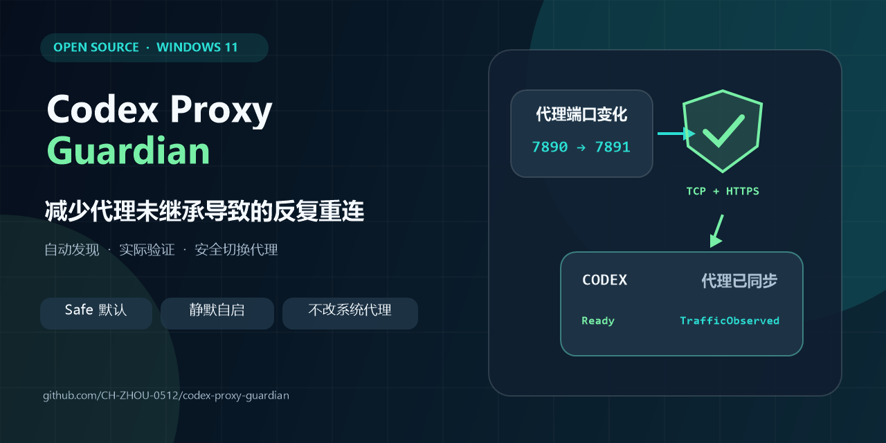

# Codex Proxy Guardian for Windows, macOS, and Linux

[简体中文](../README.md) | [English](README.en.md)



> **In one sentence:** If Codex often reconnects four or five times before it starts thinking because it did not pick up the working proxy, this tool is designed to fix that.

An unofficial current-user watchdog that validates changing HTTP, HTTPS, or SOCKS5 proxies—and the effective routes selected by PAC/WPAD—against multiple OpenAI/ChatGPT targets before applying them to Codex.

| Platform | Protected target | Normal use after setup |
|---|---|---|
| Windows 11 | Store/MSIX Codex desktop | Open Codex normally; Guardian performs a controlled repair only when needed |
| macOS (Intel / Apple Silicon) | ChatGPT/Codex desktop app | Open the app normally; Guardian performs a controlled repair only when needed |
| Linux (x64 / ARM64) | Official Codex CLI | Start with `codex-guard`; interactive terminal sessions are never killed or restarted |

## Why this exists

Many proxy applications expose a local HTTP endpoint such as `127.0.0.1:7890`. A working browser does not necessarily mean that an already-running Codex process received the same endpoint. When the proxy application restarts, changes profiles, or updates, its port may change while Codex keeps using the old address, resulting in sign-in failures, content that does not load, or interrupted tasks.

The manual workaround is to find the current port, close Codex, set proxy environment variables or launch arguments, and start Codex again—then repeat whenever the endpoint changes. Codex Proxy Guardian automates that sequence: it discovers candidates, proves that the proxy can carry real HTTPS requests, applies only a stable change, and uses debounce, cooldown, and a circuit breaker to avoid restart loops. The default `Safe` mode is intended to work without requiring users to understand ports, environment variables, or Task Scheduler.

> [!NOTE]
> This project is **not a proxy application and does not provide a proxy service or endpoints**. A working HTTP, HTTPS, or SOCKS5 endpoint—or PAC/WPAD that selects one for OpenAI targets—must already exist on the computer.

> [!IMPORTANT]
> This is an independent community project. It is not affiliated with, endorsed by, or supported by OpenAI. The proxy behavior used here is a best-effort compatibility technique, not a documented Codex desktop API.

## Safety first

- It never changes system proxy, WinHTTP proxy, DNS, routes, firewall rules, or persistent user/machine environment variables.
- It accepts HTTP, HTTPS, SOCKS5, and SOCKS5H endpoints with explicit ports. SOCKS4 and credential-bearing URLs are rejected.
- Windows delegates PAC/WPAD policy to WinHTTP. The macOS/Linux PAC runtime separately bounds source size, fetches, DNS helpers, JavaScript execution, and cache lifetime. WPAD is used only when the OS has auto-discovery enabled.
- A candidate must have a live TCP listener and pass an HTTPS request through the proxy before it can become active.
- Changes are debounced, restarts have a cooldown, and one mutex is used per installation.
- A restart-rate circuit breaker opens after three restarts in ten minutes by default, preventing an unstable environment from relaunching Codex indefinitely.
- Before a managed restart, recovery intent is persisted. If the new Codex process does not start, the guardian retries within the same rate limit instead of silently leaving Codex closed.
- Candidate ordering is deterministic and keeps the current endpoint within the same priority tier, avoiding port flip-flop.
- The MSIX manifest is periodically re-read, so a Store update can move the executable without leaving the guardian on a stale version path.
- Uninstall removes only resources whose installation marker and target paths match.
- Automatic (`Safe`) is the default mode. For a normally launched Codex process missing the current proxy argument, it waits for traffic evidence before performing one controlled repair; a process already observed using the validated proxy is left untouched.
- A daily current-user task checks this project's GitHub Releases and installs an update only after tag, filename, staged `VERSION`, and SHA-256 checks agree.
- A single-file graphical installer lets normal users install or upgrade without administrator rights.

## Supported baseline

| Area | Windows 11 | macOS | Linux |
|---|---|---|---|
| Architectures | x64, ARM64 | Intel, Apple Silicon | x64, ARM64 |
| Codex target | Store/MSIX desktop | ChatGPT/Codex desktop | Official Codex CLI |
| System discovery | Internet Settings | `scutil --proxy` | GNOME `gsettings`; use explicit config elsewhere |
| Current-user startup | Scheduled Task / HKCU Run | LaunchAgent | systemd user / XDG Autostart |
| Lifecycle action | Controlled desktop relaunch | Controlled app relaunch | No automatic CLI restart |

All platforms support explicit HTTP/HTTPS/SOCKS5 endpoints, inherited `HTTPS_PROXY` / `HTTP_PROXY` / `ALL_PROXY`, system PAC/WPAD, and recognized loopback listeners. PAC directives are evaluated for the configured OpenAI targets; a resolved endpoint must still pass the normal multi-target quorum. Mutually incompatible per-target routes safely produce no takeover. SOCKS4, credential-bearing URLs, and TUN-only configurations with no discoverable endpoint remain unsupported. See the [support matrix](SUPPORT.en.md).

> [!IMPORTANT]
> OpenAI currently provides desktop apps for macOS/Windows and the Codex CLI for Linux. There is no official Linux Codex desktop app, so the Linux edition deliberately wraps the CLI instead of claiming desktop support. See the official [Codex app](https://learn.chatgpt.com/docs/app) and [Codex CLI quickstart](https://learn.chatgpt.com/docs/quickstart).

## Install

### macOS

Download the matching stable Release asset:

- Apple Silicon: `CodexProxyGuardian-VERSION-darwin-arm64.tar.gz`
- Intel: `CodexProxyGuardian-VERSION-darwin-amd64.tar.gz`

Extract it, enter the `CodexProxyGuardian` directory, and run as your normal user:

```sh
./install.sh
codex-proxy-guardian doctor
```

The installer copies the binary under `~/.local/lib`, registers a current-user LaunchAgent, and starts it silently. Keep opening ChatGPT/Codex normally.

### Linux

Download `linux-amd64.tar.gz` or `linux-arm64.tar.gz`, extract it, then run:

```sh
./install.sh
codex-proxy-guardian doctor
codex-guard
```

Setup prefers a systemd user service and falls back to XDG Autostart. Do not use `sudo`. `codex-guard` obtains the last validated proxy and replaces itself with the official Codex CLI while preserving the terminal and all arguments, for example `codex-guard resume --last`.

Running plain `codex` still depends on that shell's environment: a guardian cannot retroactively edit another terminal process. Use `codex-guard` when the validated endpoint must be applied. Linux terminal sessions are never killed or restarted automatically.

### Windows 11: recommended one-click EXE

1. Open the [latest stable Release](https://github.com/CH-ZHOU-0512/codex-proxy-guardian/releases/latest) and download the `.exe` whose name starts with `CodexProxyGuardian-Setup-`.
2. Double-click it and confirm that the window links to `CH-ZHOU-0512/codex-proxy-guardian`.
3. Select **Install now**. Guardian starts in the background when setup completes; keep opening Codex normally afterward.

The installer is current-user only, does not request elevation, and does not change the Windows system proxy, WinHTTP, DNS, routes, or persistent environment variables. It embeds the exact ZIP produced by the same Release build and validates its version and required files before installation. During setup, the window shows the current stage and determinate 0–100% progress instead of an indefinite spinner.

> [!WARNING]
> This community project does not currently have a commercial code-signing certificate, so Windows SmartScreen may show an unrecognized-app warning. Download only from this repository's official Releases. Use the ZIP method below if the source cannot be confirmed or your policy blocks unsigned software; do not disable Windows security features.

For an optional integrity check, download the matching `.sha256` file and compare these outputs:

```powershell
Get-FileHash .\CodexProxyGuardian-Setup-*.exe -Algorithm SHA256
Get-Content .\CodexProxyGuardian-Setup-*.exe.sha256
```

### Alternative: release ZIP

Download the versioned ZIP and its `.sha256` from the same Release, extract it, and run the following in a normal, non-administrator PowerShell window. Do not use GitHub's automatically generated `Source code` archives.

```powershell
Unblock-File .\Install.ps1
.\Install.ps1
```

If your local execution policy does not allow direct invocation:

```powershell
powershell.exe -NoProfile -ExecutionPolicy Bypass -File .\Install.ps1
```

The default installation is `%LOCALAPPDATA%\CodexProxyGuardian`. Setup creates the guardian and update tasks, a **Codex (Managed Proxy)** shortcut, and a **Codex Proxy Guardian Settings** shortcut. The settings window switches mode, automatic updates, and update channel without editing JSON. If guardian Task Scheduler registration is unavailable, startup falls back to the current user's `Run` key.

Setup checks connectivity but treats a temporarily offline proxy as a warning. Use `-RequireConnectivity` to make that check mandatory:

```powershell
.\Install.ps1 -RequireConnectivity
```

To stage on a machine without Codex installed:

```powershell
.\Install.ps1 -AllowMissingCodex -NoStart
```

## Automatic and Strict modes

| User profile | Internal mode | Behavior | Recommendation |
|---|---|---|---|
| Automatic | `Safe` | Waits 20 seconds for proxy-traffic evidence; leaves a working process alone or performs one controlled repair | Default for public installs |
| Strict | `Enforce` | Repairs a missing proxy argument after debounce, without the Safe traffic-evidence exemption | Opt in when exact launch arguments must be enforced |

Use the Start Menu settings window, or switch with one command:

```powershell
.\Control.ps1 -Action SetMode -Mode Auto
.\Control.ps1 -Action SetMode -Mode Strict
.\Control.ps1 -Action ToggleMode
```

On macOS/Linux:

```sh
codex-proxy-guardian mode auto
codex-proxy-guardian mode strict
```

The earlier restart-loop class is avoided by matching the root process's proxy endpoint, not a short-lived launcher PID. HTTP/SOCKS5 variants on one host and port are treated as the same lifecycle endpoint, so a protocol preference can be updated for the next natural launch without closing the current Codex session. In short, Automatic means “prove a repair is needed first,” while Strict means “repair any endpoint mismatch.” The program does not silently change a user's long-term profile from Automatic to Strict; the automatic decision is made per Codex launch from traffic evidence. Mode changes are reloaded by the guardian in the background without restarting Guardian or the current Codex process. Explicitly opening **Codex (Managed Proxy)** remains the immediate deterministic path, and the same cooldown/circuit protection applies to every repair. On Windows, any repair that would close a running Codex prompts first and proceeds only after an explicit Yes; No, timeout, or prompt failure defers it. During a Store update, an existing Codex process is left running if the replacement MSIX executable cannot yet be resolved.

## Configuration

Configuration locations are `%LOCALAPPDATA%\CodexProxyGuardian\config.json` on Windows, `~/Library/Application Support/CodexProxyGuardian/config.json` on macOS, and `${XDG_CONFIG_HOME:-~/.config}/codex-proxy-guardian/config.json` on Linux.

Common options:

```json
{
  "ExplicitProxy": "http://127.0.0.1:7890",
  "ExplicitPAC": "",
  "AutomaticUpdates": true,
  "UpdateChannel": "Stable",
  "AllowNonLoopbackProxy": false,
  "AllowSystemNonLoopbackProxy": true,
  "ManageExternalCodexLaunches": false,
  "SafeRepairExternalCodexLaunches": true,
  "SafeExternalLaunchGraceSeconds": 20,
  "NotifyBeforeCodexRestart": true,
  "RestartPromptTimeoutSeconds": 45,
  "RestartPromptSnoozeMinutes": 10,
  "DebounceSeconds": 10,
  "RestartCooldownSeconds": 45
}
```

`ExplicitProxy` accepts `http://`, `https://`, `socks5://`, or `socks5h://`. `ExplicitPAC` accepts an absolute HTTP/HTTPS PAC URL; macOS/Linux also accept local `file://` PAC. Leave both empty to inspect the platform proxy/PAC/WPAD, inherited variables, and recognized listeners. See the Windows [default-config.json](../config/default-config.json), its [config.schema.json](../config/config.schema.json), and the [macOS/Linux defaults](../config/default-posix-config.json).

## Automatic updates

The daily updater is bound to `CH-ZHOU-0512/codex-proxy-guardian`. It requires the Release tag, archive name, staged `VERSION`, attached `.sha256`, and the GitHub asset digest when available to agree before invoking the installer. It rejects unsafe archive paths and extraction limits, snapshots the current files, and attempts to restore the previous version and guardian after an interrupted install. Results are written to `logs\update-*.jsonl`.

Starting with v1.4.4, **Check now** distinguishes a busy/skipped check from a completed current result and displays the installed version, remote version, selected channel, check time, and GitHub Releases source. It checks the channel currently selected in the UI even before the setting is applied.

Windows validation also requires the critical `chatgpt.com` target to pass. Two unrelated successful probes can no longer hide a failed streaming entry point. Guardian can detect this condition and try another discovered candidate, but it cannot repair packet loss or WebSocket resets inside the user's selected proxy-provider node without changing network policy.

On macOS/Linux the daemon selects only the `.tar.gz` for the current OS and architecture, checks the tag, semantic version, filename, staged `VERSION`, SHA-256, entry types, extraction size, and paths, then atomically replaces and executes the new binary. A failed update keeps the current binary or its `.previous` backup.

```powershell
.\Control.ps1 -Action CheckUpdate
.\Control.ps1 -Action Update
```

```sh
codex-proxy-guardian update
codex-proxy-guardian update --install
```

New installations default to the `Stable` channel. Users who deliberately want early Alpha/Beta builds can opt into `Prerelease` in Settings. An in-place update preserves the existing channel and other configuration, then asks the guardian to adopt the current Codex session.

## Status and logs

macOS/Linux:

```sh
codex-proxy-guardian status
codex-proxy-guardian status --json
codex-proxy-guardian doctor
```

Windows:

```powershell
.\Status.ps1
.\Status.ps1 -Json
.\Doctor.ps1 -Online
```

The status reports progressive effectiveness evidence:

| Evidence | Meaning |
|---|---|
| `ValidatedProxy` | The endpoint accepted a TCP connection and met the configured HTTPS-test quorum |
| `LaunchConfigured` | A current Codex root also carries the same normalized proxy argument |
| `TrafficObserved` | A Codex process-tree connection to that proxy endpoint was observed recently |

`TrafficObserved` is the strongest local evidence this project can provide without packet capture. It does not claim a particular exit IP, location, anonymity level, or proxy policy. Run `Doctor.ps1 -Online -Json` to create a deliberately redacted compatibility report; it omits raw proxy URLs, user paths, and logs.

`GuardianState` distinguishes `Stabilizing`, `Ready`, `WaitingForProxy`, `RecoveringCodex`, `RecoveryBlockedByCodex`, and `RestartCircuitOpen`. `Control.ps1 -Action Start` waits through the normal debounce phase and reports the resulting state.

Control the guardian itself without touching Codex or Windows networking:

```powershell
.\Control.ps1 -Action Restart
.\Control.ps1 -Action Stop
.\Control.ps1 -Action Start
.\Control.ps1 -Action SetMode -Mode Auto
.\Control.ps1 -Action CheckUpdate
```

Runtime status is in `status.json`; daily JSON Lines logs are under `logs`. Logs rotate by size, age, and count. Proxy credentials are never accepted or logged.

If Codex starts restarting unexpectedly, the circuit breaker will stop further relaunches. Keep Safe mode enabled and follow [Troubleshooting](TROUBLESHOOTING.en.md).

## Uninstall

On macOS/Linux, from the extracted package:

```sh
./uninstall.sh
```

This keeps configuration and logs by default. Use `./uninstall.sh --purge` only when you deliberately want both removed.

On Windows, from the release or installation directory:

```powershell
.\Uninstall.ps1 -Confirm:$false
```

To preserve logs outside the installation directory:

```powershell
.\Uninstall.ps1 -KeepLogs -Confirm:$false
```

Uninstall does not restore network settings because the project never modifies them.

## Build and test

```powershell
.\tests\Run-Tests.ps1
.\tools\Package-Release.ps1
```

The release tool runs PowerShell and Go tests, creates the Windows EXE/ZIP plus four macOS/Linux archives in `artifacts`, and writes a SHA-256 for every asset. CI also tests and compiles the native guardian on Windows, macOS, and Linux. Store/MSIX and desktop integration tests still require real user sessions. See [compatibility and effectiveness testing](COMPATIBILITY-TESTING.md) for the online proof and soak-test gates.

Architecture and threat boundaries are documented in [ARCHITECTURE.md](ARCHITECTURE.md).

## License

[MIT](../LICENSE). “Codex” and “OpenAI” may be trademarks of their respective owners; see [DISCLAIMER.md](../DISCLAIMER.md).
